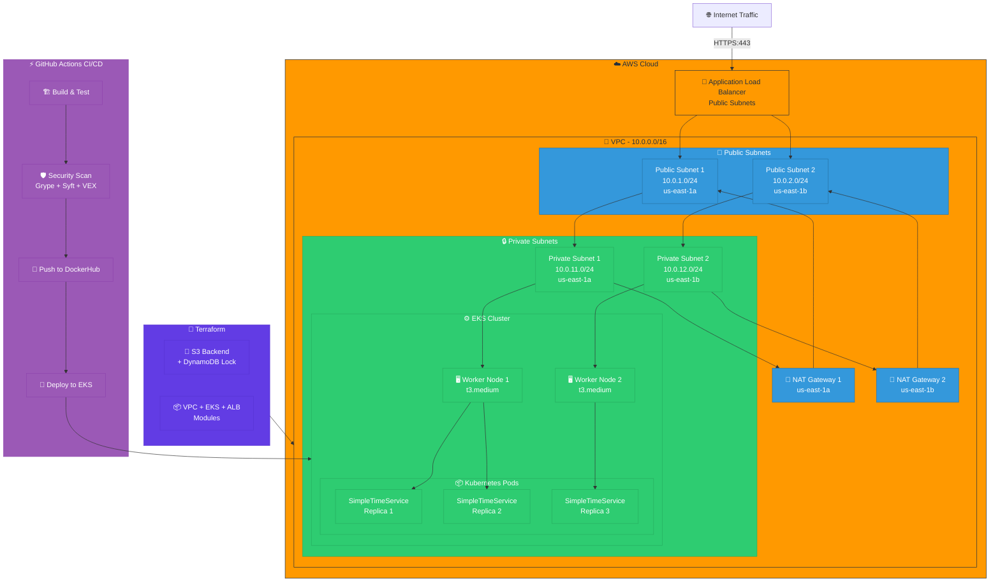

# DevOps Challenge Solution: SimpleTimeService

> A comprehensive solution demonstrating modern DevOps practices with container orchestration, infrastructure-as-code, and CI/CD automation.

## 📋 Table of Contents

- [Overview](#overview)
- [Architecture](#architecture)
- [Technology Stack](#technology-stack)
- [Quick Start](#quick-start)
- [Project Structure](#project-structure)
- [Task 1: SimpleTimeService Application](#task-1-simpletimeservice-application)
- [Task 2: Terraform Infrastructure](#task-2-terraform-infrastructure)
- [Extra Credit Features](#extra-credit-features)
- [CI/CD Pipeline](#cicd-pipeline)
- [Security](#security)
- [Documentation](#documentation)

## 🎯 Overview

This project implements a production-ready microservice deployment showcasing:

- **SimpleTimeService**: A Go-based microservice returning timestamp and client IP
- **Container Security**: Multi-stage Docker build with non-root user
- **Infrastructure-as-Code**: Terraform modules for AWS EKS deployment
- **GitOps CI/CD**: Automated build, security scan, and deployment pipeline
- **Security Scanning**: Grype, Syft, VEX, and Cosign integration
- **Remote State**: S3 backend with DynamoDB locking
- **Load Balancer**: AWS ALB with health checks
- **Auto-scaling**: HPA and Cluster Autoscaler configuration

## 🏗️ Architecture



## 🛠️ Technology Stack

| Component | Technology | Purpose |
|-----------|------------|---------|
| **Application** | Go 1.21 | High-performance microservice |
| **Container Runtime** | Docker | Application containerization |
| **Container Registry** | Docker Hub | Public image hosting |
| **Orchestration** | Kubernetes (EKS) | Container orchestration |
| **Infrastructure** | Terraform 1.6+ | Infrastructure-as-Code |
| **Cloud Provider** | AWS | Cloud infrastructure |
| **Load Balancer** | AWS ALB | Traffic distribution |
| **CI/CD** | GitHub Actions | Automated pipeline |
| **Security Scanning** | Grype, Syft, Cosign | Container security |
| **State Management** | S3 + DynamoDB | Terraform remote backend |

## 🚀 Quick Start

### Prerequisites

- **Docker** 20.10+
- **kubectl** 1.28+
- **Terraform** 1.6+
- **AWS CLI** configured with credentials
- **Helm** 3.0+ (optional)
- **Go** 1.21+ (for local development)

### 1️⃣ Run Locally with Docker

```bash
# Clone the repository
git clone <your-repo-url>
cd devops-challenge-solution

# Build the Docker image
cd app
docker build -t simpletimeservice:latest .

# Run the container
docker run -p 8080:8080 simpletimeservice:latest

# Test the service
curl http://localhost:8080/
```

**Expected Response:**
```json
{
  "timestamp": "2025-12-12T15:30:45Z",
  "ip": "172.17.0.1"
}
```

### 2️⃣ Deploy to AWS EKS with Terraform

```bash
# Navigate to Terraform directory
cd terraform

# Configure AWS credentials
export AWS_ACCESS_KEY_ID="your-access-key"
export AWS_SECRET_ACCESS_KEY="your-secret-key"
export AWS_REGION="us-west-1"

# Initialize Terraform (creates S3 backend)
terraform init

# Review the execution plan
terraform plan

# Deploy infrastructure
terraform apply

# Get EKS cluster credentials
aws eks update-kubeconfig --name simpletimeservice-cluster --region us-west-1

# Verify deployment
kubectl get pods -n simpletimeservice
kubectl get svc -n simpletimeservice

# Get Load Balancer URL
kubectl get ingress -n simpletimeservice
```

### 3️⃣ Test the Deployed Service

```bash
# Get the ALB endpoint
ALB_URL=$(terraform output -raw alb_dns_name)

# Test the service
curl http://$ALB_URL/

# Test with custom header
curl -H "X-Forwarded-For: 203.0.113.42" http://$ALB_URL/
```

### 4️⃣ Cleanup

```bash
# Destroy all infrastructure
cd terraform
terraform destroy

# Confirm deletion
# Type 'yes' when prompted
```

## 📁 Project Structure

```
devops-challenge-solution/
├── README.md                           # This file
├── .github/
│   └── workflows/
│       ├── ci-cd.yaml                  # Main CI/CD pipeline
│       └── security-scan.yaml          # Security scanning workflow
│
├── app/                                # SimpleTimeService Application
│   ├── main.go                         # Go application code
│   ├── main_test.go                    # Unit tests
│   ├── Dockerfile                      # Multi-stage Docker build
│   ├── .dockerignore                   # Docker ignore patterns
│   ├── go.mod                          # Go module definition
│   ├── go.sum                          # Go dependencies checksum
│   └── README.md                       # Application documentation
│
├── terraform/                          # Infrastructure-as-Code
│   ├── main.tf                         # Main configuration
│   ├── variables.tf                    # Input variables
│   ├── outputs.tf                      # Output values
│   ├── terraform.tfvars                # Default variable values
│   ├── backend.tf                      # S3 backend configuration
│   ├── versions.tf                     # Provider versions
│   ├── eks.tf                          # EKS cluster configuration
│   ├── vpc.tf                          # VPC and networking
│   ├── alb.tf                          # Application Load Balancer
│   ├── iam.tf                          # IAM roles and policies
│   ├── security-groups.tf              # Security group rules
│   └── README.md                       # Terraform documentation
│
├── kubernetes/                         # Kubernetes manifests
│   ├── deployment.yaml                 # Application deployment
│   ├── service.yaml                    # Service definition
│   ├── ingress.yaml                    # Ingress configuration
│   ├── hpa.yaml                        # Horizontal Pod Autoscaler
│   └── README.md                       # Kubernetes documentation
│
├── scripts/                            # Helper scripts
│   ├── build.sh                        # Build Docker image
│   ├── deploy.sh                       # Deploy to EKS
│   ├── test.sh                         # Run tests
│   ├── security-scan.sh                # Local security scanning
│   └── cleanup.sh                      # Cleanup resources
│
└── docs/                               # Additional documentation
    ├── ARCHITECTURE.md                 # Architecture deep-dive
    ├── DEPLOYMENT.md                   # Deployment guide
    ├── SECURITY.md                     # Security documentation
    └── TROUBLESHOOTING.md              # Common issues and solutions
```

## 📦 Task 1: SimpleTimeService Application

### Application Overview

SimpleTimeService is a minimal Go-based microservice that returns:
- Current server timestamp in ISO 8601 format
- Client IP address (supports X-Forwarded-For header)

### Key Features

- ✅ **Non-root user**: Runs as UID 65532 (nonroot)
- ✅ **Distroless base**: Minimal attack surface
- ✅ **Multi-stage build**: Optimized image size (~15MB)
- ✅ **Health checks**: `/health` endpoint for liveness/readiness
- ✅ **Graceful shutdown**: SIGTERM handling
- ✅ **Request logging**: Structured JSON logs
- ✅ **IP detection**: X-Forwarded-For and X-Real-IP support

### API Endpoints

#### `GET /`
Returns timestamp and client IP in JSON format.

**Response:**
```json
{
  "timestamp": "2025-12-12T15:30:45.123456789Z",
  "ip": "203.0.113.42"
}
```

#### `GET /health`
Health check endpoint for Kubernetes probes.

**Response:**
```json
{
  "status": "healthy"
}
```

### Build and Run

```bash
# Local development
cd app
go run main.go

# Docker build
docker build -t simpletimeservice:latest .

# Docker run
docker run -p 8080:8080 simpletimeservice:latest

# Run tests
go test -v ./...

# Build with security scanning
./scripts/security-scan.sh
```

### Docker Image

**Published Image:** `anuddeeph1/simpletimeservice:latest`

**Image Details:**
- Base: `gcr.io/distroless/static-debian12:nonroot`
- Size: ~15MB
- User: nonroot (65532:65532)
- Port: 8080
- Architecture: linux/amd64, linux/arm64

## 🏗️ Task 2: Terraform Infrastructure

### Infrastructure Components

#### VPC Configuration
- **CIDR Block**: 10.0.0.0/16
- **Public Subnets**: 2 (10.0.1.0/24, 10.0.2.0/24)
- **Private Subnets**: 2 (10.0.11.0/24, 10.0.12.0/24)
- **Availability Zones**: us-west-1a, us-west-1b
- **NAT Gateways**: 2 (one per AZ for HA)
- **Internet Gateway**: 1

#### EKS Cluster
- **Version**: 1.28
- **Node Group**: t3.medium instances
- **Min Nodes**: 2
- **Max Nodes**: 4
- **Desired**: 2
- **Subnets**: Private subnets only

#### Application Load Balancer
- **Type**: Application Load Balancer
- **Subnets**: Public subnets
- **Target**: EKS NodePort Service
- **Health Check**: GET /health
- **Listener**: HTTP:80 (HTTPS optional)

### Terraform Modules Used

```hcl
# VPC Module (terraform-aws-modules/vpc)
module "vpc" {
  source  = "terraform-aws-modules/vpc/aws"
  version = "~> 5.0"
}

# EKS Module (terraform-aws-modules/eks)
module "eks" {
  source  = "terraform-aws-modules/eks/aws"
  version = "~> 19.0"
}
```

### Deployment

```bash
# Configure AWS credentials
aws configure

# Initialize Terraform
cd terraform
terraform init

# Validate configuration
terraform validate

# Plan deployment
terraform plan -out=tfplan

# Apply changes
terraform apply tfplan

# View outputs
terraform output
```

### Outputs

```bash
# VPC ID
terraform output vpc_id

# EKS Cluster Name
terraform output cluster_name

# Load Balancer DNS
terraform output alb_dns_name

# Cluster Endpoint
terraform output cluster_endpoint
```

## 🏆 Extra Credit Features

### 1️⃣ Remote Terraform Backend

**S3 Backend Configuration:**
```hcl
terraform {
  backend "s3" {
    bucket         = "simpletimeservice-terraform-state"
    key            = "prod/terraform.tfstate"
    region         = "us-east-1"
    dynamodb_table = "simpletimeservice-terraform-locks"
    encrypt        = true
  }
}
```

**Features:**
- ✅ State stored in S3 with encryption
- ✅ DynamoDB table for state locking
- ✅ Prevents concurrent modifications
- ✅ State versioning enabled

**Setup:**
```bash
# Bootstrap backend resources
cd terraform
terraform init

# Backend resources are created automatically on first apply
terraform apply -target=aws_s3_bucket.terraform_state
terraform apply -target=aws_dynamodb_table.terraform_locks
```

### 2️⃣ CI/CD Pipeline

**GitHub Actions Workflow:**

```yaml
name: CI/CD Pipeline

on:
  push:
    branches: [main, develop]
  pull_request:
    branches: [main]

jobs:
  build-and-test:
    - Build Go application
    - Run unit tests
    - Code coverage report
    
  security-scan:
    - Grype vulnerability scan
    - Syft SBOM generation
    - VEX document creation
    - Cosign image signing
    
  docker-build:
    - Multi-arch Docker build
    - Push to Docker Hub
    - Tag with git SHA
    
  deploy-terraform:
    - Terraform plan
    - Terraform apply (on main branch)
    - Update Kubernetes manifests
```

**Pipeline Features:**
- ✅ Automated testing on every commit
- ✅ Security scanning with Grype/Syft
- ✅ Multi-platform Docker builds
- ✅ Automated deployment to EKS
- ✅ Container signing with Cosign
- ✅ PR validation with comments
- ✅ Slack notifications (optional)

### 3️⃣ Security Scanning

**Integrated Security Tools:**

| Tool | Purpose | Output |
|------|---------|--------|
| **Grype** | Vulnerability scanning | JSON, SARIF, Table |
| **Syft** | SBOM generation | CycloneDX, SPDX |
| **VEX** | Exploitability analysis | OpenVEX JSON |
| **Cosign** | Container signing | Keyless attestation |

**Usage:**
```bash
# Run security scan locally
./scripts/security-scan.sh

# View scan results
cat security-reports/grype/scan-report.json

# Verify signed image
cosign verify \
  --certificate-identity-regexp=".*" \
  your-dockerhub-username/simpletimeservice:latest
```

### 4️⃣ Additional Features

- ✅ **Horizontal Pod Autoscaler**: CPU-based auto-scaling
- ✅ **Cluster Autoscaler**: Node auto-scaling
- ✅ **Monitoring**: Prometheus + Grafana ready
- ✅ **Logging**: Fluent Bit for log aggregation
- ✅ **GitOps**: ArgoCD integration ready
- ✅ **Secret Management**: AWS Secrets Manager integration
- ✅ **Network Policies**: Zero-trust networking
- ✅ **Pod Security**: PSS Baseline compliance

## ⚡ CI/CD Pipeline

### Workflow Triggers

```yaml
# Push to main/develop branches
on:
  push:
    branches: [main, develop]
    paths:
      - 'app/**'
      - 'terraform/**'
      - '.github/workflows/**'

# Pull requests to main
on:
  pull_request:
    branches: [main]
```

### Pipeline Stages

#### 1. Build and Test
- Checkout code
- Setup Go environment
- Run unit tests
- Generate coverage report
- Lint code with golangci-lint

#### 2. Security Scan
- Build Docker image
- Scan with Grype (vulnerabilities)
- Generate SBOM with Syft
- Create VEX document
- Sign image with Cosign

#### 3. Docker Build and Push
- Multi-arch build (amd64, arm64)
- Tag with git SHA and version
- Push to Docker Hub
- Update manifest files

#### 4. Deploy to EKS
- Configure AWS credentials
- Run Terraform plan
- Apply Terraform (on main branch)
- Update kubectl context
- Deploy Kubernetes manifests
- Verify deployment health

### Environment Variables

```bash
# Required GitHub Secrets
DOCKERHUB_USERNAME     # Docker Hub username
DOCKERHUB_TOKEN        # Docker Hub access token
AWS_ACCESS_KEY_ID      # AWS access key
AWS_SECRET_ACCESS_KEY  # AWS secret key
AWS_REGION             # AWS region (us-east-1)
```

## 🔐 Security

### Container Security

- ✅ **Non-root user**: Runs as UID 65532
- ✅ **Distroless base**: Minimal attack surface
- ✅ **No shell**: Cannot execute shell commands
- ✅ **Read-only rootfs**: Immutable container filesystem
- ✅ **Drop capabilities**: Minimal Linux capabilities
- ✅ **Security context**: securityContext enforced

### Network Security

- ✅ **Private subnets**: EKS nodes in private subnets
- ✅ **Security groups**: Restrictive ingress/egress rules
- ✅ **Network policies**: Zero-trust pod networking
- ✅ **ALB**: Public endpoint with WAF ready

### Infrastructure Security

- ✅ **IAM roles**: Least privilege access
- ✅ **Encryption**: Data at rest and in transit
- ✅ **KMS**: Customer-managed encryption keys
- ✅ **Secrets Manager**: Secure credential storage
- ✅ **VPC endpoints**: Private AWS service access

### Compliance

- ✅ **Pod Security Standards**: Baseline compliance
- ✅ **CIS Benchmarks**: EKS best practices
- ✅ **OWASP Top 10**: Security controls implemented
- ✅ **Vulnerability scanning**: Automated Grype scans

## 📚 Documentation

| Document | Description |
|----------|-------------|
| [ARCHITECTURE.md](docs/ARCHITECTURE.md) | Detailed architecture documentation |
| [DEPLOYMENT.md](docs/DEPLOYMENT.md) | Step-by-step deployment guide |
| [SECURITY.md](docs/SECURITY.md) | Security implementation details |
| [TROUBLESHOOTING.md](docs/TROUBLESHOOTING.md) | Common issues and solutions |
| [app/README.md](app/README.md) | Application documentation |
| [terraform/README.md](terraform/README.md) | Terraform module documentation |

## 🎯 Acceptance Criteria

### ✅ Task 1 - Application & Container

- [x] Application returns JSON with timestamp and IP
- [x] Dockerfile with multi-stage build
- [x] Container runs as non-root user
- [x] `docker build` creates the image
- [x] `docker run` executes the container
- [x] Container stays running (no crashes)
- [x] Image published to Docker Hub
- [x] README with deployment instructions

### ✅ Task 2 - Terraform Infrastructure

- [x] VPC with 2 public and 2 private subnets
- [x] EKS cluster deployed to VPC
- [x] Tasks/nodes in private subnets only
- [x] Load balancer in public subnets
- [x] `terraform plan` validates configuration
- [x] `terraform apply` creates infrastructure
- [x] Application accessible via load balancer
- [x] Variables and terraform.tfvars provided
- [x] README with deployment instructions

### ✅ Extra Credit

- [x] Remote Terraform backend (S3 + DynamoDB)
- [x] CI/CD pipeline with GitHub Actions
- [x] Security scanning (Grype + Syft + Cosign)
- [x] Container signing and attestation
- [x] Horizontal Pod Autoscaler
- [x] Multi-architecture support

## 🤝 Contributing

1. Fork the repository
2. Create a feature branch: `git checkout -b feature/amazing-feature`
3. Commit changes: `git commit -m 'Add amazing feature'`
4. Push to branch: `git push origin feature/amazing-feature`
5. Open a Pull Request

## 📝 License

This project is licensed under the MIT License.

## 📧 Contact

For questions or feedback, contact: careers@particle41.com

---

**Built with ❤️ for the Particle41 DevOps Team Challenge** 🚀

